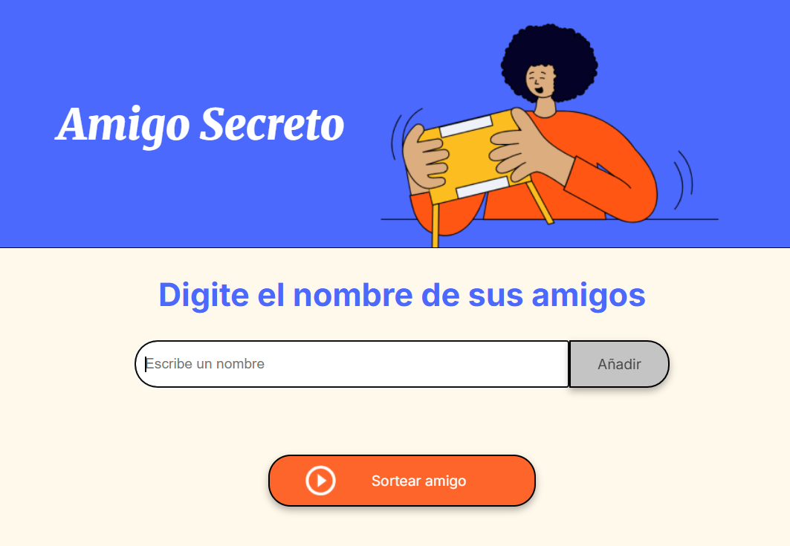
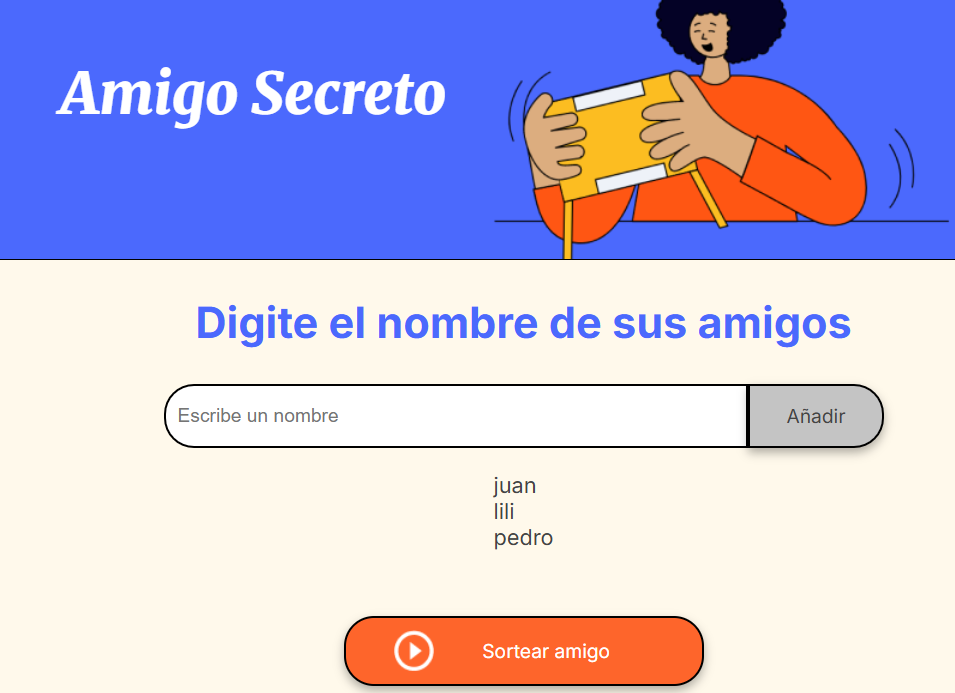
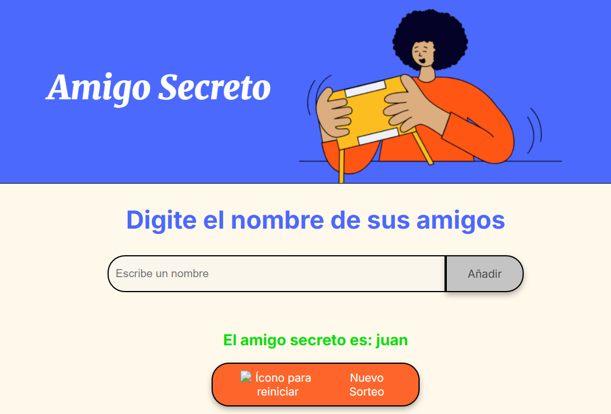

# JUEGO DEL AMIGO SECRETO
<p align = "center">

</p>

## Descripción
Este proyecto challenge "AMIGO SECRETO" es una aplicación web sencilla creada con HTML5, CSS y JavaScript que permite organizar un sorteo de Amigo Secreto de manera fácil y rápida.

## Características
- ✅ Agregar nombres: los usuarios pueden agregar nombres de sus amigos que entraran al sorteo 
- ✅ Validaciones de entrada: valida que no se ingresen numeros o caracteres especiales y que no repiten nombres
- ✅ notificaciones: muestra notificaciones de las entradas como errores, cuando termina el proceso.
- ✅ resultados: muestra el nombre del nombre que selecciono aleatoriamente.

Es una herramienta ideal para eventos familiares, amigos o compañeros de trabajo. ¡Haz que el intercambio de regalos sea más divertido y sin complicaciones! 🎉

## Instalación

1. Clona este repositorio:
   ```bash
   git clone https://github.com/usuario/sistema-amigo-secreto.git
   ```
   Abre el archivo index.html en tu navegador.
   
## Uso
Abre el archivo index.html en tu navegador.
Agrega nombres en el campo de texto y haz clic en "Añadir".
Una vez que tengas una lista de amigos, haz clic en "Sortear amigo" para realizar el sorteo.
Disfruta del resultado y reinicia el juego si lo deseas.

### Pantalla principal


### Pantalla agregando nombres


### Resultado del sorteo


## Tecnologías
- 🛠️ HTML5
- 🚀 JavaScript
- 🔥 CSS3

## Contribución
Si deseas contribuir bienvenido, por favor sigue estos pasos:
1. Haz un fork del repositorio
2. Crea una nueva rama (`git checkout -b feature-nueva`)
3. Realiza tus cambios y haz commit (`git commit -m 'Agregando nueva característica'`)
4. Sube los cambios (`git push origin feature-nueva`)
5. Abre un Pull Request

## Licencia
Este proyecto está bajo la licencia [MIT](LICENSE).

## Contacto
✉️ Correo: hecthort@outook.com  

